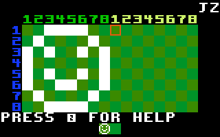

This [IntyBASIC](http://nanochess.org/intybasic.html) program is a
simple bitmap editor, meant for designing
[Intellivision](https://en.wikipedia.org/wiki/Intellivision)
background cards.



You can run this program on a real Intellivision by using a flash
cartridge such as [LTO Flash!](http://ltoflash.leftturnonly.info/),
or you can run it on a modern computer using an emulator such as
[jzIntv](http://spatula-city.org/~im14u2c/intv/).

The bitmap editor lets you design two cards at once.  Use the disc to
move (on jzIntv, the arrow keys), and press any side button (such as
Shift on jzIntv) to invert the pixel the cursor is on.  You can hold
down the side button while moving to draw lines.

To clear the screen, press CLEAR on the Intellivision keypad (or press
'-' on jzIntv).

To save your bitmap, press 1.  The bitmap is saved in the format of an
IntyBASIC snippet, which can be incorporated into an IntyBASIC program.

## Saving bitmaps with LTO Flash!

To save your bitmap on LTO Flash!, you need to have a USB cable
connected between the LTO Flash! cartridge and a host computer.  On
the host computer, run a serial terminal program, set to 8-N-1, with a
baud rate of 2000000.  (Yes, that's two million baud.)  This baud rate
is a bit unusual, so not all programs support it.  I recommend
[Decisive Tactics Serial](https://www.decisivetactics.com/products/serial/)
on Mac OS X.

Or you can just use the program `show-serial` which is in this
repository, which works on Mac OS X and Linux.  `show-serial` takes
one command-line argument, the name of the serial device.  To find the
name of the serial device, try `ls /dev/cu.*` on Mac OS X, or `ls
/dev/ttyUSB*` on Linux.

If the LTO Flash! is on the title screen or menu, the serial terminal
will periodically print "LOCUTUS".  This is normal and harmless.

The bitmap editor will display a USB icon in the upper-right corner
when the LTO Flash! is connected to a host computer.

## Saving bitmaps with jzIntv

On the jzIntv emulator, pressing 1 will append the current bitmap to
the file `bitmap.bas`.  This only works if your specify the `--file-io`
argument when running jzIntv.  For example,

```
jzintv -z3 --file-io . editor.rom
```

will place `bitmap.bas` in the current directory.

The bitmap editor will display two letters (an abbreviation of the
emulator name) in the upper right corner when running on a supported
emulator.  (Currently only jzIntv supports saving to a file.)

## License

The bitmap editor is licensed under the
[GNU General Public License, version 3](https://www.gnu.org/licenses/gpl-3.0.en.html),
or (at your option) any later version.

The `.mac` files in this repository come from the jzIntv distribution.
